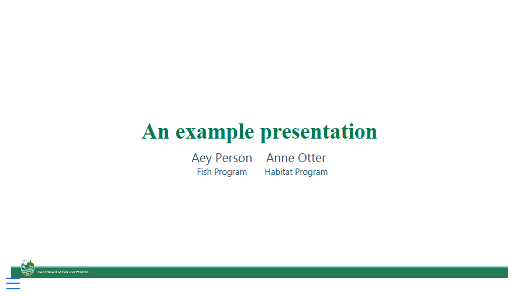
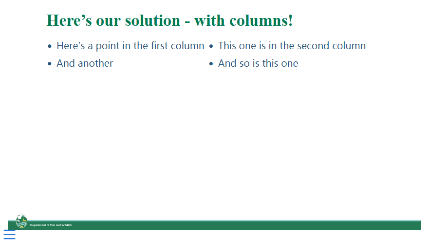

This repo contains some basic templates for presentations that (mostly) follow the WDFW style guide. The `example-presentation.qmd` includes the YAML arguments necessary to include the CSS and footer image. This requires that you copy the `templates` directory into the directory with your presentation Quarto file. There is also an incomplete PowerPoint template, but it does not always work well.

There is a lot of room for improvement here, including a custom title slide (see `templates/wdfw-title-slide.html` for the beginnings of that). Feel free to fork or PR any improvements!

